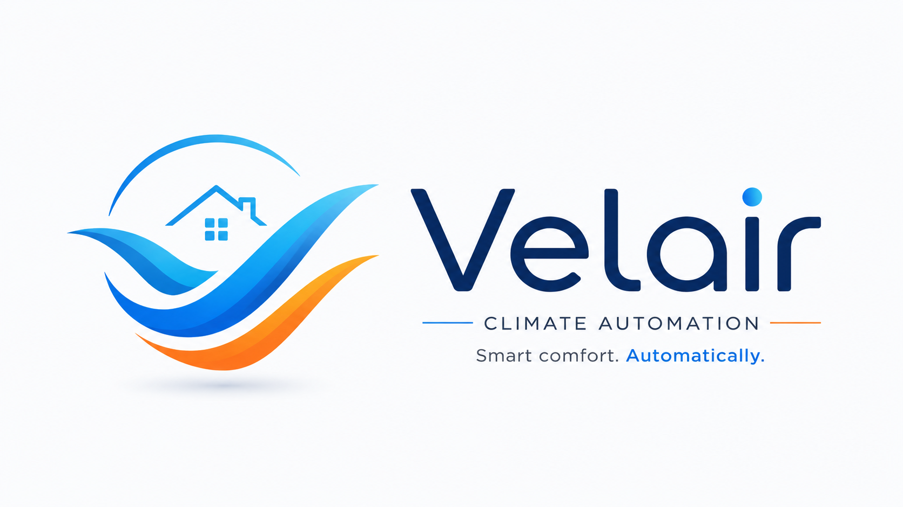
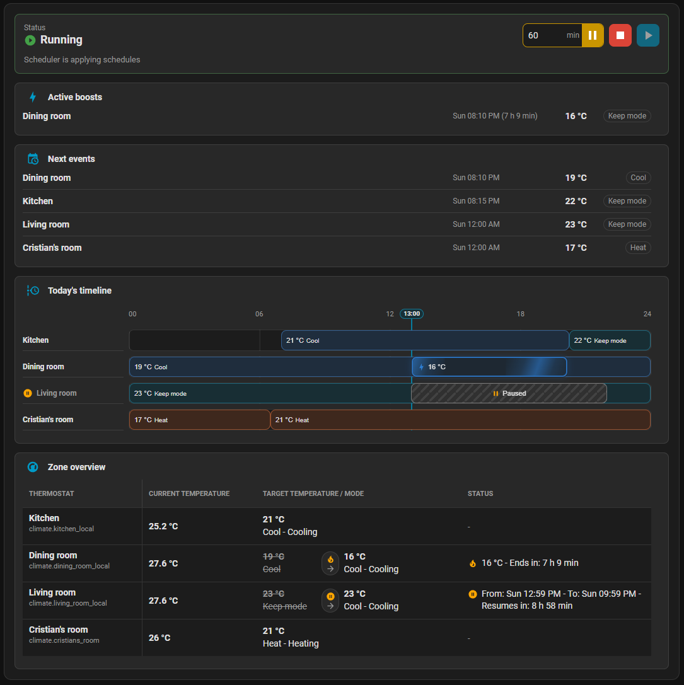
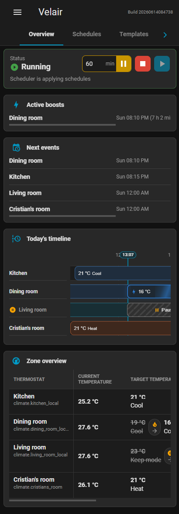

# Velair
Climate automation that adapts to your life.

[](#)
[](#)
[](#)
[](https://www.hacs.xyz/docs/faq/custom_repositories/)
[](https://www.buymeacoffee.com/cgonfer)
[](https://www.paypal.me/cristiangonfer94)




Velair is a Home Assistant custom integration for managing clear, local-first climate schedules on top of standard `climate.*` entities. It provides a sidebar panel, an optional Lovelace card, schedule templates, per-zone boosts, and automation-friendly services without depending on any thermostat vendor cloud.

Velair does not replace your thermostat integration. It works through Home Assistant entities, so it can manage any compatible climate device that is already exposed to Home Assistant.

## Why Velair Exists

Velair started from a practical Home Assistant use case: keeping climate control local and reliable while recovering scheduling features that were becoming harder to use from a vendor app because of subscription changes and rate limits.

The project is not intended to criticize or offend any brand. It is a community contribution for users who want local-first home automation, simple day-to-day workflows, and a scheduler that can work across different climate integrations.

Velair is maintained by Cristian Gonzalez Fernandez, a Home Assistant enthusiast who enjoys building software projects in his free time to solve practical everyday problems through automation and technology.

Contributions, testing, bug reports, and constructive feedback are always welcome. This project is maintained on a best-effort basis alongside work and daily life, so responses and updates may sometimes take a little time.

## Features

- Home Assistant sidebar panel registered automatically by the integration.
- Optional Lovelace card using the same bundled frontend.
- Visual schedule editor for managed `climate.*` entities.
- Weekly schedules per climate zone.
- Schedule blocks for temperature targets or turning a climate entity off.
- Optional HVAC mode per block, with a `Keep` option when the mode should not be changed.
- Support for heating, cooling, heat/cool, auto, dry, fan-only, and off modes where the climate entity supports them.
- Drag and resize interactions on a 24-hour timeline.
- Day cloning to other weekdays or other managed climates.
- Editable schedule templates with import/export support.
- Overview tab with scheduler status, active boosts, next events, and zone summaries.
- Settings tab with startup behavior, thermostat diagnostics, portability tools, and maintenance information.
- Global pause, stop, and resume controls, plus per-zone pause and resume.
- Velair-scoped services for boosts, pauses, schedule application, schedule editing, day cloning, and schedule clearing.
- Automation events through `velair_event` for scheduler mode changes, climate targets applied by Velair, boosts, and per-zone pause/resume lifecycle changes.
- Push updates through Home Assistant WebSocket events, without frontend polling.
- English and Spanish UI translations.

## Screenshots

The following examples are captured from a real Home Assistant instance. See the screenshot guide for the complete public screenshot set.

### Overview

| Desktop | Mobile |
| --- | --- |
|  |  |

[View more screenshots](docs/project/screenshots.md)

## Installation

Velair is designed for HACS and manual installation.

<details>
  <summary>HACS</summary>

  <br>
  Until Velair is accepted into the default HACS store, add it as a custom repository:

  1. Open HACS.
  2. Open the three-dot menu.
  3. Select **Custom repositories**.
  4. Add this repository URL: `https://github.com/cgonfer/velair`.
  5. Select **Integration** as the category.
  6. Install Velair.
  7. Restart Home Assistant.
  8. Add Velair from **Settings > Devices & services**.

  [](https://my.home-assistant.io/redirect/hacs_repository/?owner=cgonfer&repository=velair&category=integration)
</details>

<details>
  <summary>Manual</summary>

  <br>
  For manual installation from a release, download `velair-custom-component-<version>.zip` from the GitHub Release assets and extract it so Home Assistant has:
  
  ```text
  <home_assistant_config>/custom_components/velair
  ```
  
  For manual installation from a repository checkout, copy this directory:
  
  ```text
  custom_components/velair
  ```
  
  to:
  
  ```text
  <home_assistant_config>/custom_components/velair
  ```
  
  Restart Home Assistant and add Velair from **Settings > Devices & services**.
  
</details>

For development builds, see [docs/developer/development.md](docs/developer/development.md).

## Basic Usage

1. Add the Velair integration.
2. Select the `climate.*` entities Velair may manage.
3. Open Velair from the Home Assistant sidebar.
4. Choose a climate and weekday.
5. Add schedule blocks.
6. Save the day.
7. Clone the day or create templates when useful.

See [docs/user/usage.md](docs/user/usage.md) for the full workflow.

## Optional Lovelace Card

The sidebar panel is the main Velair experience. The Lovelace card is optional.

Before adding a card, install and configure the Velair integration first. The Lovelace resource is served by the integration, so it is available after Home Assistant has loaded Velair.

### Add The Lovelace Resource

1. Open Home Assistant.
2. Go to **Settings > Dashboards**.
3. Open the three-dot menu.
4. Select **Resources**.
5. Select **Add resource**.
6. Use this URL:

```text
/velair_frontend/velair-card.js
```

7. Select **JavaScript module** as the resource type.
8. Save the resource.
9. Reload the browser or the Home Assistant companion app.

The resource can also be represented as YAML:

```yaml
url: /velair_frontend/velair-card.js
type: module
```

### Add Your First Card

1. Open a dashboard.
2. Select **Edit dashboard**.
3. Select **Add card**.
4. Select **Manual**.
5. Paste this example:

```yaml
type: custom:velair-card
view: overview-status
```

6. Save the card.

This first card shows the scheduler status and pause/stop/resume controls. You can add more Velair cards to the same dashboard by changing the `view` value.

Supported `view` values:

- `overview-status`: scheduler state and pause/stop/resume controls.
- `overview-boosts`: active boosts.
- `overview-events`: next events.
- `overview-timeline`: today's timeline.
- `overview-zones`: zone overview.
- `schedules`: full schedule editor.

If Home Assistant shows a custom element error, confirm that Velair is installed, the resource URL is exactly `/velair_frontend/velair-card.js`, and the browser or companion app has been reloaded after adding the resource.

## Documentation

### User Guides

- [Documentation index](docs/README.md)
- [Usage guide](docs/user/usage.md)
- [Installation](docs/user/installation.md)
- [Troubleshooting](docs/user/troubleshooting.md)

### Developer Guides

- [Architecture](docs/developer/architecture.md)
- [WebSocket API](docs/developer/api.md)
- [Frontend development](docs/developer/frontend.md)
- [Development guide](docs/developer/development.md)
- [Manual testing](docs/developer/manual-testing.md)

### Project Notes

- [Screenshot capture](docs/project/screenshots.md)

## Repository Structure

```text
custom_components/velair/     Home Assistant integration
frontend/                     TypeScript/Lit frontend source and build tooling
docs/                         User, developer, and project documentation grouped by topic
tests/                        Unit tests
screenshots/                  Real screenshots for public documentation
hacs.json                     HACS metadata
```

## Contributing

Contributions are welcome. The project especially benefits from:

- Testing with different climate platforms.
- Reports about unsupported HVAC modes or thermostat capabilities.
- Mobile and tablet UX feedback.
- Documentation improvements.
- Pull requests that keep the code maintainable and aligned with Home Assistant conventions.

Please read [docs/developer/development.md](docs/developer/development.md) before opening a pull request.

## Donations

Velair is a community project maintained in free time. If Velair helps simplify your Home Assistant climate setup and you want to support future development, donations are welcome:

[](https://www.buymeacoffee.com/cgonfer)
[](https://www.paypal.me/cristiangonfer94)

Donations are optional and do not change the best-effort support model, but they are always appreciated.

## License

MIT. See [LICENSE](LICENSE).
