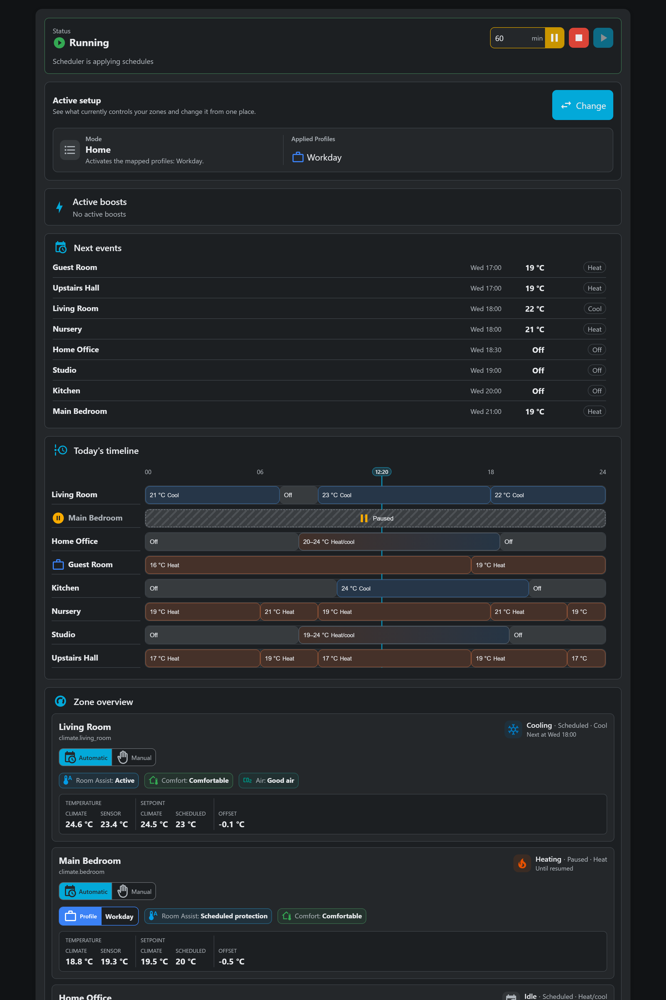
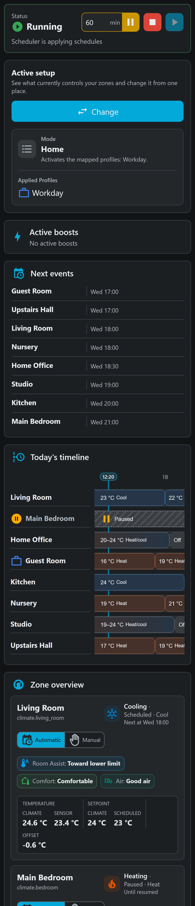

# Velair
Climate automation that adapts to your life.

[Explore Velair on the project website](https://cgonfer.github.io/velair/)

[](https://github.com/cgonfer/velair/releases)
[](https://github.com/cgonfer/velair/commits/main/)
[](https://community.home-assistant.io/t/velair-local-first-climate-scheduling-for-home-assistant-climates/1015394)
[](https://www.hacs.xyz/docs/use/repositories/dashboard/)
[](https://www.buymeacoffee.com/cgonfer)
[](https://www.paypal.me/cristiangonfer94)


Velair brings local-first scheduling to the `climate.*` entities you already use in Home Assistant. Plan heating and cooling from its sidebar panel, and add the optional Lovelace card if you want to check on a room or control it from your dashboard.

Velair works with your existing thermostat integration rather than replacing it. Its scheduler runs in Home Assistant; whether the device itself needs a cloud connection depends on that integration.

## Why Velair Exists

I started Velair because the scheduling features I used in a vendor app were becoming harder to use as subscriptions and rate limits changed. I wanted to keep my climate schedules in Home Assistant and make that option useful to people with other compatible thermostats too. It's a community contribution, not a criticism of any brand.

## When plans change

Set up your normal week once. When plans change, switch to another Mode, boost one room, or pause a schedule without rebuilding it. Velair shows what's active and what's coming next for each climate.

## Features

- A weekly schedule editor for each climate, with reusable templates and Profiles.
- Schedule blocks that can set a temperature or range, change only the HVAC mode, send supported options such as a preset without a temperature, or turn the climate off.
- Manual adjustment when you want to take direct control of a climate.
- Optional Adaptive Preconditioning and Room Assist for earlier starts and separate room-temperature sensors.
- Environmental Comfort and air-quality readings, with optional outdoor comparisons and ventilation guidance. These are observations; Velair does not open windows or adjust the climate based on them.
- See what Velair is doing in Overview, investigate problems in Diagnostics, or add a card for one climate to your dashboard.
- Home Assistant entities, services, events, and blueprints for automations. Compatible external controllers can also receive published schedules.

Velair's interface is available in English, Spanish, German, French, Italian,
Dutch, Polish, Russian, and Portuguese for Brazil and Portugal.

## Screenshots

These screenshots use example data and Home Assistant's dark theme. See
[more screenshots](docs/project/screenshots.md) for desktop, tablet, and mobile views.

| Desktop | Mobile |
| --- | --- |
|  |  |

## Installation

Velair is available in the default HACS store and can also be installed manually.

1. In HACS, search for **Velair** under integrations and select **Download**.
2. Restart Home Assistant.
3. Add Velair from **Settings > Devices & services** and select the `climate.*` entities it may manage.

[](https://my.home-assistant.io/redirect/hacs_repository/?owner=cgonfer&repository=velair&category=integration)

<details>
  <summary>Manual installation</summary>

  <br>
  Download `velair-custom-component-<version>.zip` from the latest GitHub release and extract it so Home Assistant has:

  ```text
  <home_assistant_config>/custom_components/velair
  ```

  Restart Home Assistant and add Velair from **Settings > Devices & services**.

  See the [installation guide](docs/user/installation.md) for repository-checkout and development-build instructions.
</details>

## Basic Usage

1. Open Velair from the Home Assistant sidebar.
2. Choose one of your managed climates and a day of the week.
3. Add schedule blocks and save the day.

Clone days or create templates when useful. The [usage guide](docs/user/usage.md)
covers the full workflow. Velair follows Home Assistant's temperature unit; if
you are upgrading older data or importing a backup from another unit, read
[Temperature Units and Migration](docs/user/temperature-units.md) first.

## Optional Lovelace Card

The sidebar panel is the main Velair experience. To add the optional card,
first install and configure the integration. In **Settings > Dashboards**,
open the three-dot menu and select **Resources**. Add this resource as a
**JavaScript module**, then reload the browser or Home Assistant companion app:

```yaml
url: /velair_frontend/velair-card.js
type: module
```

In an editable dashboard, add a manual card for one Velair-managed climate:

```yaml
type: custom:velair-card
view: climate
selected_entity: climate.living_room
```

Replace `climate.living_room` with your managed climate. The
[card usage guide](docs/user/usage.md#climate-status-and-control-card) covers the
visual editor, other views, actions, and display options. If Home Assistant shows a
custom element error, see [troubleshooting](docs/user/troubleshooting.md).

## Documentation

Start with the [documentation index](docs/README.md), or go directly to the
[usage guide](docs/user/usage.md), [Environmental Comfort](docs/user/comfort.md),
[sensor reference](docs/user/sensors.md), or [troubleshooting](docs/user/troubleshooting.md).
The [development guide](docs/developer/development.md) covers the repository and
contribution workflow.

## Contributing

I'm Cristian Gonzalez Fernandez, and I maintain Velair in my free time. Reports
from different climate integrations, mobile and tablet feedback, documentation
improvements, and pull requests are all welcome. Please read the
[development guide](docs/developer/development.md) before contributing. I may
not always reply quickly, but I appreciate the feedback. For help, check
[troubleshooting](docs/user/troubleshooting.md) or ask in the
[Home Assistant community thread](https://community.home-assistant.io/t/velair-local-first-climate-scheduling-for-home-assistant-climates/1015394).
To report a reproducible bug, [open an issue](https://github.com/cgonfer/velair/issues).

## Donations

Velair is a community project maintained in free time. If Velair helps simplify your Home Assistant climate setup and you want to support future development, donations are welcome:

[](https://www.buymeacoffee.com/cgonfer)
[](https://www.paypal.me/cristiangonfer94)

Donations are optional and do not change the best-effort support model, but they are always appreciated.

## License

MIT. See [LICENSE](LICENSE).
